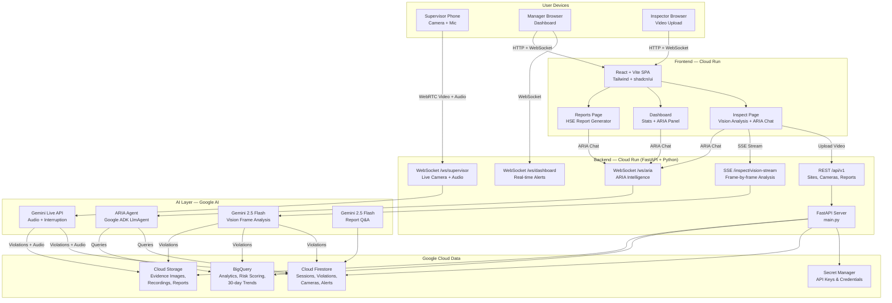

# SiteGuard AI 🛡️

**AI-Powered Workplace Safety Agent — Built for the Gemini Live Agent Challenge**

> **Categories:** Live Agents · UI Navigator
> Built with Gemini 2.5 Flash · Gemini Live API · Google ADK · Cloud Run · Firestore · BigQuery

SiteGuard AI detects OSHA violations in real-time from construction site videos and live camera feeds. The ARIA intelligence agent answers safety questions, queries violation history, and generates HSE compliance reports — all powered by Gemini on Google Cloud.

---

## What We Built

Construction sites have a 20% fatality rate compared to all industries. OSHA violations go undetected because human supervisors can't watch every camera simultaneously, and post-incident reports come too late. SiteGuard AI solves this with always-on AI vision that:

1. **Detects violations as they happen** 
3. **Generates compliance-ready OSHA reports automatically** — saving hours of documentation
4. **Answers follow-up questions about findings** — via the ARIA conversational agent

---

## Features

### Vision Inspection
- Upload any site video (MP4, MOV, AVI)
- Gemini 2.5 Flash extracts and analyzes frames at 0.5fps
- Smart deduplication: skips repeated hazard categories to avoid noise
- Evidence-backed violations with annotated frame images
- Two scan modes: **Smart** (dedup, faster) and **Every Frame** (thorough)
- Real-time SSE stream pushes violations to the browser as they're detected

### ARIA Intelligence Agent
- Powered by Google ADK LlmAgent with function tool calling
- Session-scoped queries: ARIA only answers about the current video scan
- Fast path: keyword matching → direct Firestore/BigQuery queries (<200ms)
- Slow path: full ADK agent with tools: `get_violations`, `get_recent_violations`, `get_live_site_status`, `search_osha_standards`
- Evidence images inline in chat responses
- Available on all three pages with context-aware preset questions

### Safety Dashboard
- Live violation trends (BigQuery 30-day analytics)
- Severity breakdown (Critical/High/Medium/Low)
- Risk scoring per site
- ARIA always visible as permanent right panel

### HSE Compliance Reports
- Auto-generates PDF-ready OSHA & NEBOSH reports
- Progress bar with step-by-step status
- Evidence images embedded in report
- ARIA Q&A panel for report analysis
- Download to PDF via browser print

---

## Demo

Watch the full demo below to see how the system performs real-time vision inspection, detects hazards, and streams violations directly to the interface.

[](https://youtu.be/0FQLYJ8zywo)

### Try It Yourself

To test the system, you can upload safety-related videos.

- Search on YouTube for **OSHA violations**
- Download videos using tools like y2mate

### Example Videos for Testing

Use the following sample videos:

- [Construction Safety Violations Example 1](https://www.youtube.com/watch?v=gxz03mP8E58&t=13s)
- [Construction Safety Violations Example 2](https://www.youtube.com/watch?v=PfEhTDXs4Yg)

### Features Overview

| Feature | Description |
|---------|-------------|
| Vision Inspection | Upload site video → Gemini analyzes frames → violations stream in real-time |
| ARIA Agent | Ask "What violations were found?" → Google ADK queries Firestore/BigQuery |
| Safety Dashboard | Live stats, 30-day trends, ARIA side panel always visible |
| HSE Reports | Auto-generate and download OSHA-mapped compliance PDF |
| Live Supervisor | WebRTC camera with real-time monitoring and interaction |

---

## Architecture

```
User Browser ──→ React SPA (Cloud Run :3000)
                    │
                    ├── SSE  ──→ FastAPI (Cloud Run :8080) ──→ Gemini 2.5 Flash
                    ├── WS   ──→ ARIA Agent (Google ADK)   ──→ Firestore / BigQuery
                    └── REST ──→ REST API                  ──→ Cloud Storage
```



### Data Flow

**1. Video Inspection**
```
User uploads video
  → Backend: FFmpeg extracts frames at 0.5fps
  → Gemini 2.5 Flash: analyzes each frame for OSHA violations
  → Smart dedup: skips repeat hazard categories within 20-frame window
  → SSE stream: violations pushed to browser in real-time
  → Firestore: violations stored with annotated evidence images
  → ARIA Agent: user can ask questions scoped to this inspection session
```

**2. ARIA Intelligence**
```
User sends natural language query
  → WebSocket → ARIA Agent (Google ADK LlmAgent)
  → Fast path: keyword matching → Firestore/BigQuery direct query (<200ms)
  → Slow path: Gemini ADK → tool calls (get_violations, get_site_status, etc.)
  → Response with text + evidence images → WebSocket → browser
```

**3. Live Supervisor Mode**
```
Supervisor opens phone camera
  → WebRTC video + audio frames → WebSocket /ws/supervisor
  → Gemini Live API: real-time vision + speech with barge-in support
  → Violations → Firestore → WebSocket /ws/dashboard → Manager alert
  → Voice response in worker's language (70+ supported)
```

### Technology Stack

| Layer | Technology | Purpose |
|-------|-----------|---------|
| Frontend | React 18 + Vite + Tailwind CSS v4 | SPA UI |
| UI Components | shadcn/ui + Radix UI | Accessible components |
| Charts | Recharts | Violation trend visualization |
| Backend | Python 3.12 + FastAPI + uvicorn | REST + WebSocket server |
| AI — Vision | Gemini 2.5 Flash (Vertex AI) | Frame-by-frame violation detection |
| AI — Live | Gemini Live API | Real-time voice + vision |
| AI — Agent | Google ADK (LlmAgent) | ARIA conversational intelligence |
| Database | Cloud Firestore | Real-time violations, sessions, cameras |
| Analytics | BigQuery | Compliance trends, risk scoring |
| Storage | Cloud Storage | Evidence images, recordings, reports |
| Secrets | Secret Manager | API keys, service credentials |
| Deployment | Cloud Run | Auto-scaling containerized services |
| CI/CD | Cloud Build | Automated build + deploy pipeline |
| Video | FFmpeg + OpenCV | Frame extraction and annotation |

---

## Quick Start (Local Development)

### Prerequisites
- Python 3.12+
- Node.js 20+
- A Google Cloud project with Firestore, BigQuery, Cloud Storage enabled
- Gemini API key from [Google AI Studio](https://aistudio.google.com/app/apikey)
- A GCP service account JSON with Firestore/BigQuery/Storage permissions

### 1. Clone & configure

```bash
git clone https://github.com/YOUR_USERNAME/siteguard-ai.git
cd siteguard-ai

# Backend environment
cp backend/.env.example backend/.env
# Edit backend/.env and fill in:
#   GEMINI_API_KEY=your-key-here
#   GCP_PROJECT_ID=your-project-id
# Place your service-account.json in backend/
```

### 2. Run with Docker Compose (recommended)

```bash
docker compose up --build
```

- Frontend: http://localhost:3000
- Backend: http://localhost:8080
- Health check: http://localhost:8080/health

### 3. Run manually (without Docker)

**Backend:**
```bash
cd backend
python -m venv venv
source venv/bin/activate          # Windows: venv\Scripts\activate
pip install -r requirements.txt
export GOOGLE_APPLICATION_CREDENTIALS=./service-account.json
python main.py
# Runs on http://localhost:8080
```

**Frontend:**
```bash
cd frontend
npm install
npm run dev
# Runs on http://localhost:3000
```

---

## Cloud Deployment (Google Cloud Run)

### One-command deploy

```bash
chmod +x deploy.sh
./deploy.sh YOUR_GCP_PROJECT_ID us-central1
```

This script will:
1. Enable required GCP APIs
2. Store `GEMINI_API_KEY` in Secret Manager
3. Build and push Docker images to Container Registry
4. Deploy backend to Cloud Run
5. Build frontend with backend URL injected at build time
6. Deploy frontend to Cloud Run

### CI/CD with Cloud Build

Connect your GitHub repo to Cloud Build, then every push to `main` triggers `cloudbuild.yaml`.

```bash
gcloud builds submit --config cloudbuild.yaml \
  --project YOUR_GCP_PROJECT_ID
```

---

## Environment Variables

### Backend (`backend/.env`)

| Variable | Required | Description |
|----------|----------|-------------|
| `GEMINI_API_KEY` | ✅ | From [Google AI Studio](https://aistudio.google.com) |
| `GCP_PROJECT_ID` | ✅ | Your GCP project ID |
| `GCP_REGION` | — | Default: `us-central1` |
| `GCS_BUCKET_EVIDENCE` | — | Default: `siteguard-evidence` |
| `GCS_BUCKET_REPORTS` | — | Default: `siteguard-reports` |
| `GCS_BUCKET_RECORDINGS` | — | Default: `siteguard-recordings` |
| `CORS_ORIGINS` | — | Comma-separated allowed origins (default: `localhost:3000,localhost:5173`) |
| `ENVIRONMENT` | — | `development` or `production` |

### Frontend (`frontend/.env.local`)

| Variable | Required | Description |
|----------|----------|-------------|
| `VITE_BACKEND_API_URL` | — | Backend URL (auto-detects localhost in dev) |
| `VITE_BACKEND_WS_URL` | — | Backend WebSocket URL |

Copy `frontend/.env.example` → `frontend/.env.local` and fill in for production.

---

## Project Structure

```
siteguard-ai/
├── backend/                    # Python FastAPI backend
│   ├── agents/
│   │   ├── aria_agent.py       # ARIA — Google ADK LlmAgent
│   │   └── orchestrator.py     # Root safety orchestrator
│   ├── api/
│   │   ├── routes.py           # REST endpoints
│   │   ├── agent_ws.py         # ARIA WebSocket handler
│   │   ├── vision_stream.py    # Frame analysis SSE
│   │   └── websocket.py        # Supervisor + Dashboard WS
│   ├── core/
│   │   ├── config.py           # Pydantic settings (env-based)
│   │   └── safety_standards.py # OSHA knowledge base
│   ├── services/
│   │   ├── firestore_service.py
│   │   ├── bigquery_service.py
│   │   ├── storage_service.py
│   │   ├── live_api_service.py # Gemini Live API
│   │   └── vertex_ai_service.py # Gemini batch analysis
│   ├── tools/
│   │   └── adk_tools.py        # ADK function tool definitions
│   ├── Dockerfile
│   ├── .env.example            # ← copy to .env, fill in secrets
│   └── requirements.txt
│
├── frontend/                   # React + Vite frontend
│   ├── src/
│   │   ├── app/
│   │   │   ├── App.tsx         # React Router SPA
│   │   │   └── components/
│   │   │       ├── InspectPage.tsx   # Video upload + ARIA
│   │   │       ├── DashboardPage.tsx # Stats + ARIA panel
│   │   │       └── ReportsPage.tsx   # Report + ARIA
│   │   ├── hooks/
│   │   │   ├── useGeminiLive.ts  # ARIA WebSocket hook
│   │   │   ├── useVisionStream.ts # SSE vision hook
│   │   │   └── useReportARIA.ts  # Report Q&A hook
│   │   └── lib/
│   │       ├── types.ts          # Type definitions + URL helpers
│   │       └── api.ts            # API client
│   ├── .env.example
│   └── Dockerfile
│
├── submission/                 # Hackathon submission materials
│   ├── ARCHITECTURE.md         # System diagram (Mermaid)
│   ├── DESCRIPTION.md          # Project description
│   ├── SUBMISSION_CHECKLIST.md # Requirements checklist
│   └── DEPLOYMENT_PROOF.md     # GCP proof instructions
│
├── docker-compose.yml          # Local development
├── cloudbuild.yaml             # GCP CI/CD pipeline
├── deploy.sh                   # One-command deploy script
└── README.md                   # This file
```

---

## API Reference

### REST Endpoints

| Method | Path | Description |
|--------|------|-------------|
| GET | `/health` | Health check |
| POST | `/api/v1/recordings/upload` | Upload video file |
| GET | `/api/v1/inspect/vision-stream` | SSE: real-time frame analysis |
| GET | `/api/v1/sites/{id}/violations` | List violations |
| GET | `/api/v1/sites/{id}/analytics` | 30-day analytics |
| POST | `/api/v1/aria/report-query` | ARIA report Q&A |

### WebSocket Endpoints

| Path | Purpose |
|------|---------|
| `/ws/aria?site_id=X` | ARIA conversational agent |
| `/ws/supervisor?camera_id=X&site_id=Y` | Live supervisor mode |
| `/ws/dashboard?site_id=X` | Real-time alert feed |

---

## Google Cloud Services Used

| Service | Purpose |
|---------|---------|
| **Cloud Run** | Host backend (FastAPI) + frontend (React) containers |
| **Gemini 2.5 Flash** (Vertex AI) | Vision analysis, OSHA violation detection |
| **Gemini Live API** | Real-time voice + vision with barge-in |
| **Google ADK** | ARIA conversational agent framework |
| **Cloud Firestore** | Violations, sessions, cameras, alerts |
| **BigQuery** | Analytics, 30-day trends, risk scoring |
| **Cloud Storage** | Evidence images, recordings, reports |
| **Secret Manager** | Secure API key storage in production |
| **Cloud Build** | Automated CI/CD pipeline |

---

## Security

- Secrets stored in **Google Secret Manager** (never in code or Docker images)
- CORS restricted to specific allowed origins (`CORS_ORIGINS` env var)
- Service account credentials mounted at runtime, excluded from Docker image via `.dockerignore`
- No hardcoded credentials — all config via environment variables
- Non-root user in Docker containers

---

## Findings & Learnings

1. **Deduplication is critical for video analysis** — Gemini generates slightly different violation type strings for the same hazard across frames. We solved this by mapping to a `HazardCategory` enum before deduplication, not using raw strings.

2. **Session isolation matters** — ARIA needs to know which video scan to query. We implemented a `set_inspection_session` WebSocket control message that scopes all subsequent ARIA queries to the active session.

3. **Fast path vs ADK path** — For common queries (violations, OSHA codes), a fast direct Firestore/BigQuery path returns in <200ms. The full ADK agent takes 2-5s. Keyword routing gives users the best of both.

4. **Gemini Live API barge-in** — The native audio model handles interruptions gracefully out of the box. The key was using `gemini-live-2.5-flash-native-audio` (GA) instead of preview models.

5. **React hooks ordering** — Temporal Dead Zone errors occur when `useCallback` hooks reference values from hooks declared later. The fix: declare all provider hooks before all consumer hooks.

---

## License

MIT — see [LICENSE](LICENSE)

---

